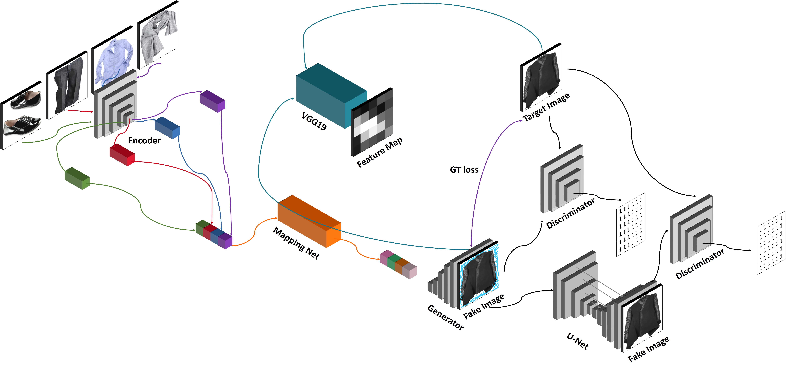
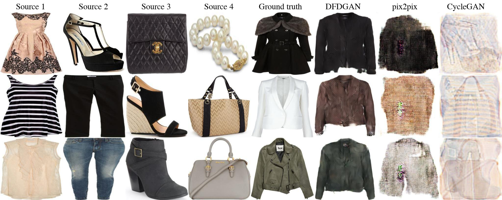
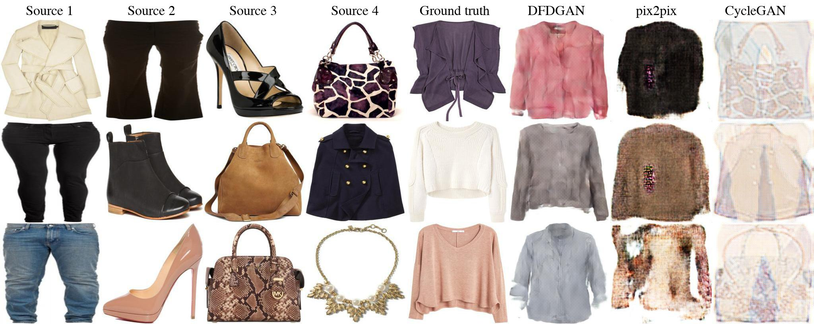
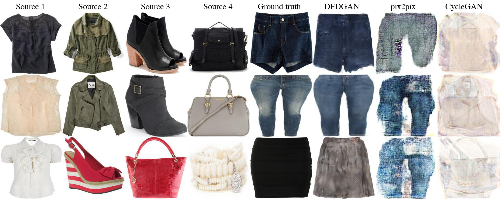
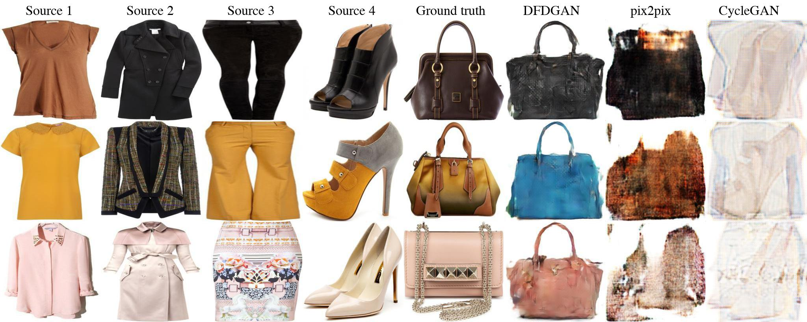
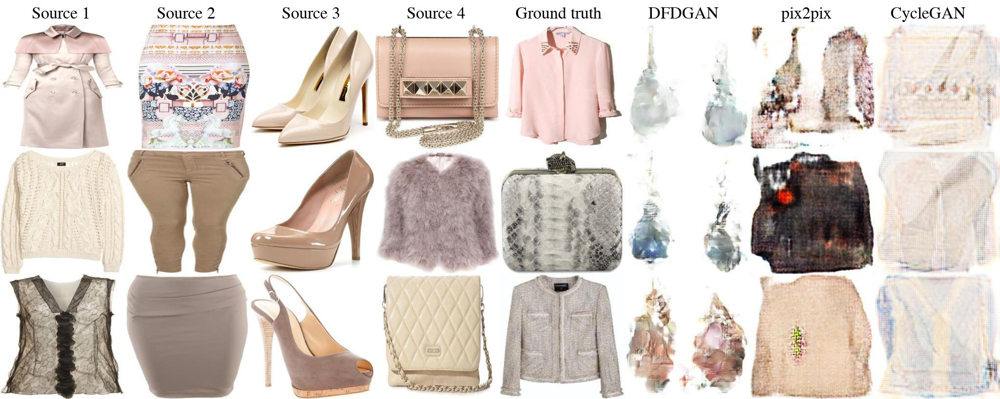
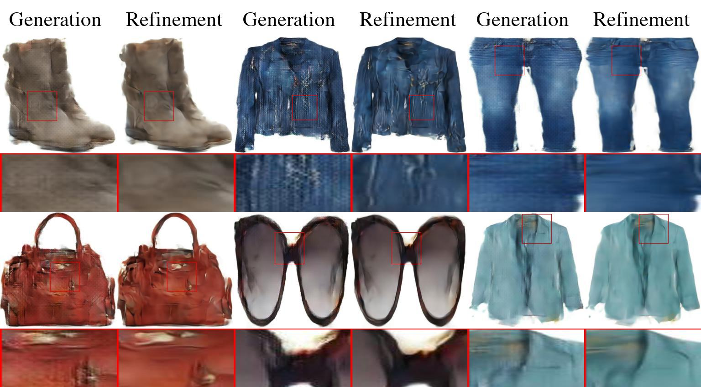
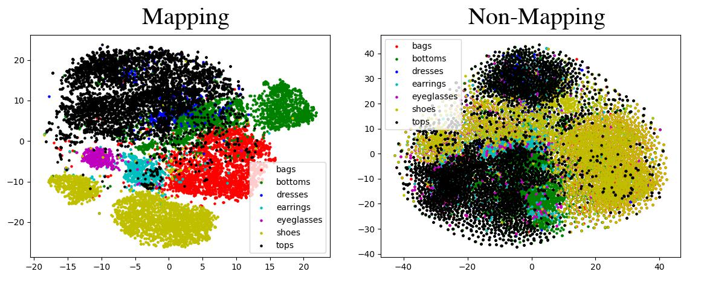
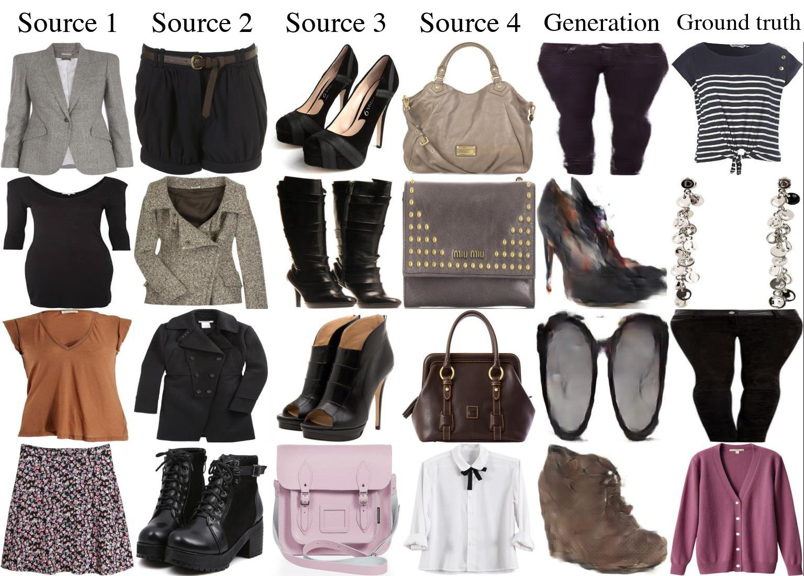

# Deep Fashion Designer GAN (DFD_GAN)
This repository have code for DFD GAN. This GAN takes four difference categories of fashion items and generates a suitable fashion item.

## Requirements
* python3.7+
* pytorch 1.7.0
* others.

## Usage
training a model
```bash
python3 main.py --config config.yml
```

testing a model
```bash
Not implmented yet
```

## Architecture


## Tops Results



## Bottoms Results


## Accessories Results



## Refinement Results


## Mapping Network Results


## Wrong Results


## Comments
None for now.
## Reference
1. [Dataset](https://github.com/xthan/polyvore)
2. [Spectral Normalization](https://github.com/christiancosgrove/pytorch-spectral-normalization-gan/blob/master/spectral_normalization.py)
3. [U-net](https://github.com/milesial/Pytorch-UNet)
4. [FINCH Clustering](https://github.com/ssarfraz/FINCH-Clustering)
5. [BIT](https://github.com/google-research/big_transfer)