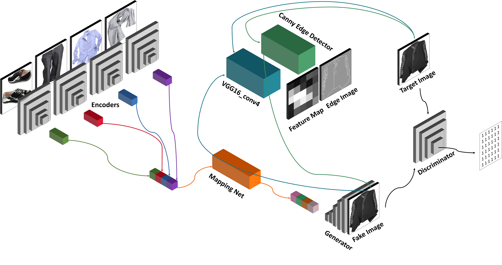
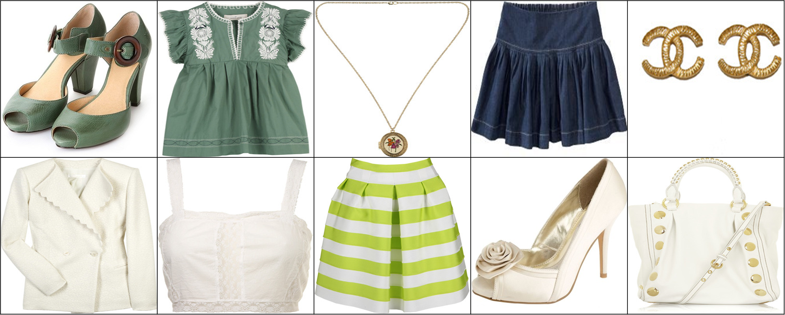

# Deep_Fashion_Designer_Gan
This repository have code for DFD GAN. 

## Requirements
* python3.6+
* pytorch 1.6.0
* others.

## Loss
* WGAN-GP
* LSGAN-GP

## Usage
training a model
```bash
python3 main.py --config config.yml
```

testing a model
```bash
Not implmented yet
```

## Dataset Format (Json)
```
[
  "216897157", # outfit_set_id
  { # GT images in a set
   "index": 1,
   "category": 0
  },
  [ # input image list in a set
   {
    "index": 2,
    "category": -1
   },
   {
    "index": 3,
    "category": -1
   },
   {
    "index": 4,
    "category": -1
   },
   {
    "index": 5,
    "category": -1
   }
  ]
 ]
```

## Architecture


## Example

The left most image is a GT image and the rest of images are input to DFD GAN in a row.

## Results


## Comments
None for now.
## Reference
1. Canny Edge Detector : https://github.com/DCurro/CannyEdgePytorch
2. Spectral Normalization : https://github.com/christiancosgrove/pytorch-spectral-normalization-gan/blob/master/spectral_normalization.